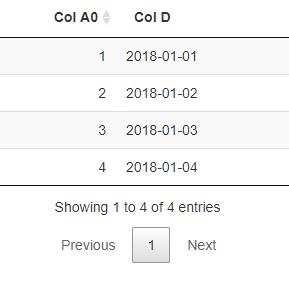

# shinyXT - eXtensible Table framework for R/Shiny
[](https://travis-ci.org/numeract/shinyXT)
[](https://codecov.io/github/numeract/shinyXT?branch=master)

**The package is currently under active development, please expect major 
changes while the API stabilizes.**

## Motivation

The package allows the configuration and formatting of Shiny DataTable and Form 
templates that are meant to be re-used, as well as other Shiny functionalities.


## Installation

```
# install.packages("devtools")
devtools::install_github("numeract/shinyXT")
```

### Simple Example

```
library(shiny)
library(shinyXT)
onetable_df <- data.frame(
    a0_num = c(1, 2, 3, 4),
    d_date = as.Date(c("2018-01-01", "2018-01-02", "2018-01-03", "2018-01-04"))
)

onetable_xt <- list(
    .default = list(
        col_name = NA_character_,
        class = NA_character_,
        ui_name = NA_character_,
        hover = NULL,
        widget = NULL,
        format = NULL,
        column_width = 3,  
        width = "100%",     
        visible = TRUE,
        enabled = TRUE,
        validate = NULL
    ),
    .options = list(
        format_Date = quote(format_utc),
        visible = c("a0_num", "d_date")
    ),
    
    a0_num = list(
        col_name = "a0_num",
        class = "numeric",
        ui_name = "Col A0",
        hover = "Numeric, no decimals",
        widget = "numericInput",
        format = "",
        validate = NULL
    ),
    
    d_date = list(
        col_name = "d_date",
        class = "Date",
        ui_name = "Col D",
        hover = "Date (date only), not missing",
        widget = "dateInput",
        format = "date",
        validate = NULL
    )
)

ui <- shinyUI(fluidPage( 
    tabPanel(
        title = "View",
        p(),
        DT::dataTableOutput("view_dt"))
)
)


server <- shinyServer(function(input, output, session) {
    
    # Data ----
    # load data and create default context
    context_default <- list(
        tbl_name = "onetable",
        tbl_lst = list(
            onetable = onetable_df
        ),
        filter_lst = NULL,
        mode = "dt",
        xt_lst = list(
            onetable = onetable_xt
        )
    )

    output$view_dt <- DT::renderDataTable({
        .context <- context_default
        shinyXT::createDT(.context)
    })
})

shinyApp(ui, server)
```



