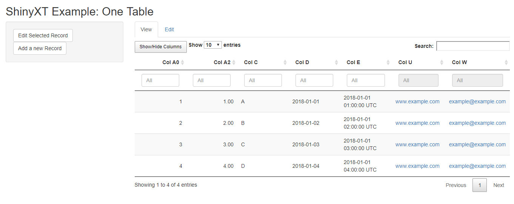
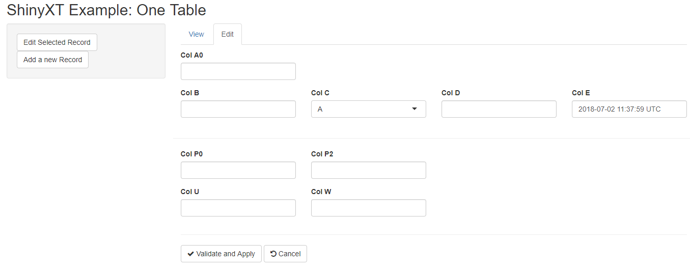
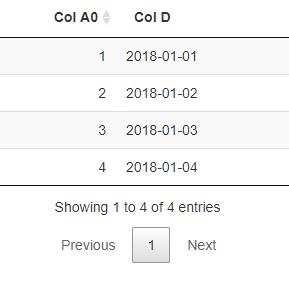

# shinyXT - eXtensible Table framework for R/Shiny
[](https://travis-ci.org/numeract/shinyXT)
[](https://codecov.io/github/numeract/shinyXT?branch=master)

**The package is currently under active development, please expect major 
changes while the API stabilizes.**


## Motivation

The package allows the configuration and formatting of Shiny DT DataTables and 
form templates that are meant to be re-used, as well as other Shiny 
functionalities. The functions receive custom settings and use them to create 
DT DataTable templates - work like a Factory design pattern. 
A common configuration interface (`context`) can be used to render 
multiple DataTable objects (e.g. two tables linked using a foreign key.)

The main advantages of using shinyXT for creating and formatting DT DataTable:

- Flexibility: if the user wants to change a feature of the DataTable objects, 
  is enough to modify the settings and the change will be propagated in all 
  DataTable objects that are created with the same settings
- Greater control achieved by using a standard template
- The server code becomes much shorter


## Installation

```R
# install.packages("devtools")
devtools::install_github("numeract/shinyXT")
```

## Functions

- Configuration mode :
    + `getConfigMode` : extracts configuration mode from a context
    + `checkDataConfig` : check XT configuration columns
    + `getConfigField` : gets the configuration field
- DataTable functions:
    + `jsDT` : adds JS scripts to be used with Data Table calls
    + `formatDT` : formats a DataTable
    + `createDT` : creates a DataTable based on custom settings
- Form utilities:
    + `createForm`
    + `validateForm`
- `Shiny` customized views:
    + `progressInfo` : displays a progress info bar that works in console or in Shiny
    + `downloadButtonWithIcon` : creates a download button with icon
- `ShinyXT` utils:
    + `brXT` and `hrXT`
    + `getFullTbl` and `getFilteredTbl`
    + `getNARow`
    + `choices` : creates a "choices" vector for `shiny::selectizeInput` 
    + `isNotEmptyChr`


## Examples

### Included Example

The following lines illustrate how the default shinyXT included example can be 
run and its output.

```R
library(shinyXT)
shinyXT::shinyXTExample()

```
Output:






### createDT Example

The following example shows the utility of `createDT` function and the way 
a context containing custom settings is created and passed to it.

```R
library(shiny)
library(shinyXT)

onetable_df <- data.frame(
    a0_num = c(1, 2, 3, 4),
    d_date = as.Date(
        c("2018-01-01", "2018-01-02", "2018-01-03", "2018-01-04"))
)

onetable_xt <- list(
    .default = list(
        col_name = NA_character_,
        class = NA_character_,
        ui_name = NA_character_,
        hover = NULL,
        widget = NULL,
        format = NULL,
        column_width = 3,  
        width = "100%",     
        visible = TRUE,
        enabled = TRUE,
        validate = NULL),
    .options = list(
        format_Date = quote(format_utc),
        visible = c("a0_num", "d_date")),
    a0_num = list(
        col_name = "a0_num",
        class = "numeric",
        ui_name = "Col A0",
        hover = "Numeric, no decimals",
        widget = "numericInput",
        format = "",
        validate = NULL),
    d_date = list(
        col_name = "d_date",
        class = "Date",
        ui_name = "Col D",
        hover = "Date (date only), not missing",
        widget = "dateInput",
        format = "date",
        validate = NULL)
)


ui <- shinyUI(fluidPage( 
    tabPanel(
        title = "View",
        p(),
        DT::dataTableOutput("view_dt"))
    )
)


server <- shinyServer(function(input, output, session) {
    context_default <- list(
        tbl_name = "onetable",
        tbl_lst = list(
            onetable = onetable_df
        ),
        filter_lst = NULL,
        mode = "dt",
        xt_lst = list(
            onetable = onetable_xt
        )
    )
    output$view_dt <- DT::renderDataTable({
        .context <- context_default
        shinyXT::createDT(.context)
    })
})

shinyApp(ui, server)
```
Output: 




## TODO

- Integrate shinyXT with Shiny Modules
- Cascade filter module
